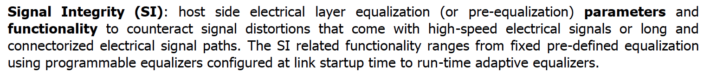
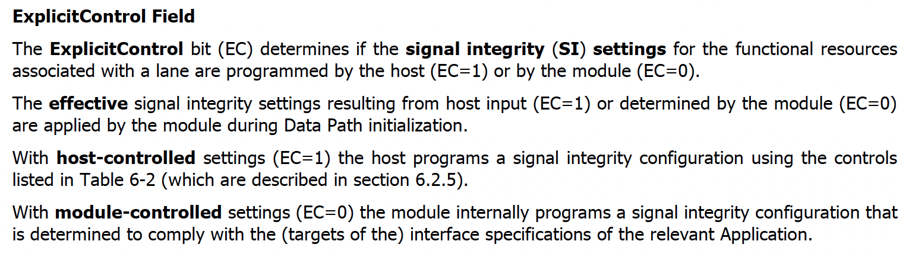

Introduction
============

To ensure link stability, proper tuning, and optimal performance, certain high-speed QSFP_DD, OSFP, and QSFP modules need their Signal Integrity (SI) settings to align with platform media settings.

Signal Integrity
----------------

From CMIS 5.3 specification, definition of Signal Integrity:

    
    CMIS SI Definition

Signal Integrity (SI) settings can differ based on the combination of module and platform vendors. Modules come with default TX/RX SI settings programmed into their EEPROM by the module vendor. However, platform vendors have the capability to overwrite these settings to suit their specific platform needs. When the TX Input Adaptive EQ is disabled for all TX Data Path lanes, the host can apply new TX SI settings. RX SI settings, on the other hand, can be applied directly. It's important to ensure that these TX/RX settings are applied with the Explicit Control bit set to 1.

Explicit Control
----------------

From CMIS 5.3 specification, definition of Explicit Control:

    
    CMIS Explicit Control