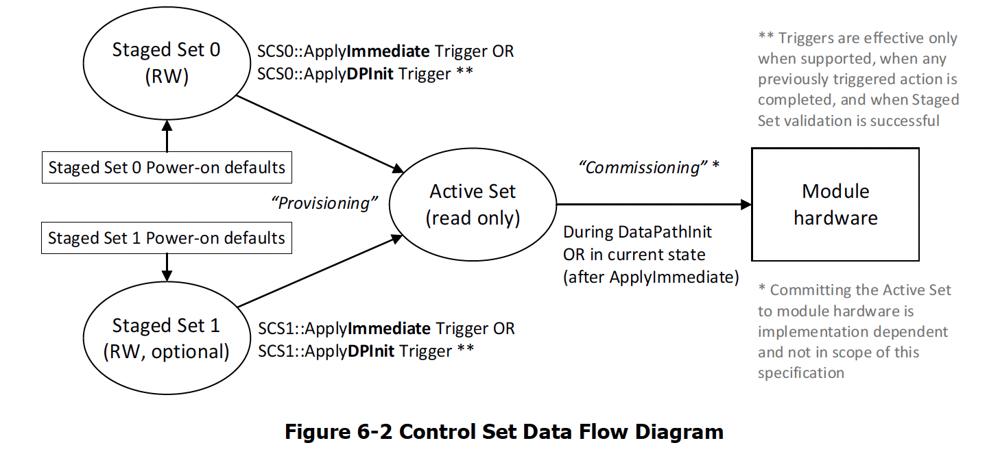
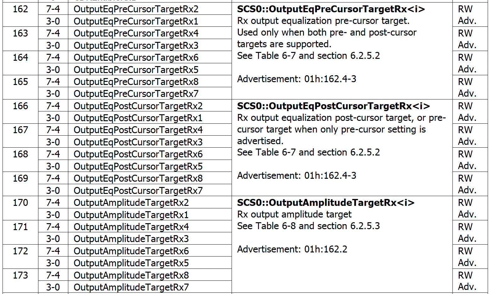

RX Output EQ Optimization Test
========================================

    RX Output Equalization Optimization

For cable/transceiver manufacturers, proper tuning RX output equalizer is critical because:

1. **Lack of Control Over TX Equalization**: The TX equalization is set by the host, leaving you with no control over it.
2. **Compensation for Host TX Equalization**: You must compensate for the host's TX equalization, regardless of whether it is optimized.
3. **Signal Quality Determination**: The quality of the signal you send back to the host is determined by your RX output equalization.
4. **Impact on Host Receiver**: If your RX output equalizer is not well-tuned, the host receiver may struggle, leading to higher bit error rates (BER), link instability, or even failure to establish a reliable connection. Your transceiver might seem low-quality, even if it isn’t! Data center engineers will blame your module if links are unstable. A well-tuned RX Output EQ ensures your module works seamlessly with different host TX settings.

Objective
----------

Using CMIS standard page/reg addresses, the test aims to find the transceiver RX output equalization settings that delivers the best PRBS BER performance. The test exhausts all the RX output equalization combinations to find the optimal setting.

* **What It Does**: Controls how the transceiver drives the signal back to the host, adjusting amplitude and emphasis to compensate for losses.
* **Why It Matters**: If RX Output Equalization isn't tuned well, the host’s receiver might struggle to recover the data cleanly, leading to errors. 
* **How We Optimize It**:

    * Sweep precursor, amplitude, and postcursor values to find the best setting.
    * Use BER feedback from PRBS testing to fine-tune the equalizer.
    * Ensure settings comply with CMIS-defined control registers.

Setup
----------

* The transceiver has three RX output equalizers to adjust: amplitude, precursor and postcursor.
* Each EQ has a range, ``<min>`` and ``<max>``, in code values.
* PRBS measurement duration ``<duration>``.
* PRBS polynomial ``<polynomial>``.

Methodology
--------------

The principle of the test is to find the RX Output EQ settings that deliver the best PRBS BER performance. The test is based on the CMIS standard page/reg addresses. The test is automated and can be run on Xena test equipment with Z800 Freya modules.

1. Check if the transceiver module supports **RX Output EQ Control** as described in `RX Output EQ Support Advertisement`_. If the transceiver module supports RX Output EQ Control, the test can be run. Else, the test will abort.
2. Start PRBS test pattern transmission from the TX port to the RX port, and measure the PRBS BER at the RX port. The measurement is set to accumulative mode to get a stable BER value after a certain duration.
3. If the transceiver module supports **Reconfiguration** (``00h:2.6 SteppedConfigOnly``, ``00h:2.1-0 AutoConmmisioning``), write the **RX output EQ settings to the RX Output EQ registers**. This is implemented by writing ``10h:162-173``, as described in `RX Output EQ Register`_.
4. Trigger the **Provision-and-Commission** or **Provision** procedure via ``10h:144`` or ``10h:143``.
5. Read the ``ConfigStatus`` register to check if the RX output EQ settings are applied. This is implemented by reading ``11h:202-205``.
6. If ``ConfigStatus == ConfigSuccess``, wait for a certain duration to allow the RX output EQ settings to stablize. Clear PRBS BER counter. Read the PRBS BER at the RX port for a certain duration, and save the last reading.
7. If ``ConfigStatus != ConfigSuccess``, skip the PRBS measurement and continue to the next RX output EQ settings.
8. An **exhaustive search** is performed to find the RX output EQ settings that yield **the lowest PRBS BER**. Thus, the test will repeat until all possible RX output EQ settings are tested.

    CMIS Control Set Data Flow

RX Equalizer Control
--------------------

RX EQ (RX output equalizer control) settings can be directly written and applied for RX output equalization if RX Output Controls are Supported.

RX Output EQ Support Advertisement
^^^^^^^^^^^^^^^^^^^^^^^^^^^^^^^^^^^

.. _cmis_rx_eq_support:

.. figure:: images/cmis_rx_eq_support.png

    RX Output EQ Advertisement

The RX Ouput EQ Advertisement: ``01h:162``, as defined in :numref:`cmis_rx_eq_support`, can be used to check if the module supports RX output equalization control.

RX Output EQ Register
^^^^^^^^^^^^^^^^^^^^^^

.. _cmis_rx_output_eq_reg:

    RX Output EQ Registers

RX Output EQ register control: ``10h:162–173``, as defined in :numref:`cmis_rx_output_eq_reg`, can be used to control the RX output EQ settings.
