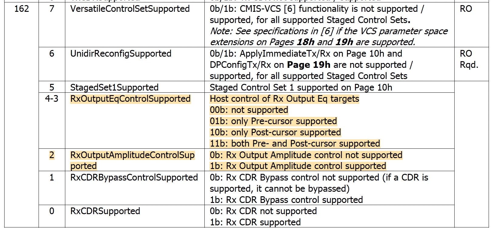

RX Output Equalizatoin Test
===========================

Objective
----------

Using CMIS standard page/reg addresses, the test aims to find the transceiver output RX equalizer settings that delivers the best PRBS BER performance. The test exhausts all the RX output equalizer combinations to find the optimal setting.

* What It Does: Controls how the transceiver drives the signal back to the host, adjusting amplitude and emphasis to compensate for losses.
* Why It Matters: If RX Output Equalization isn't tuned well, the host’s receiver might struggle to recover the data cleanly, leading to errors. 
* How We Optimize It:

    * Sweep precursor, amplitude, and postcursor values to find the best setting.
    * Use BER feedback from PRBS testing to fine-tune the equalizer.
    * Ensure settings comply with CMIS-defined control registers.

Setup
----------

* The transceiver has three RX output equalizers to adjust: amplitude, precursor and postcursor.
* Each tap has a range, ``<min>`` and ``<max>``, in dB
* PRBS measurement duration ``<duration>``.
* PRBS polynomial ``<polynomial>``.

Methodology
--------------

The principle of the test is to find the RX Ouput EQ settings that deliver the best PRBS BER performance. The test is based on the CMIS standard page/reg addresses. The test is automated and can be run on Xena test equipment with Z800 Freya modules.

1. Check if the transceiver module supports the EQ control as described in `RX Output EQ Advertisement`_. If the transceiver module supports EQ control, the test can be run. Else, the test will abort.
2. Start PRBS test pattern transmission from the TX port to the RX port, and measure the PRBS BER at the RX port. The measurement is set to accumulative mode to get a stable BER value after a certain duration.
3. If the transceiver module supports Hot Reconfiguration (``00h:2.6 SteppedConfigOnly``, ``00h:2.1-0 AutoConmmisioning``), write the RX output EQ settings to the RX Output EQ registers. This is implemented by writing ``10h:162-173``.
4. Trigger the Provision-and-Commission procedure via ``10h:144`` by writing ``0xFF``.
5. Read the ``ConfigStatus`` register to check if the RX output EQ settings are applied. This is implemented by reading ``11h:202-205``.
6. If ``ConfigStatus == ConfigSuccess``, wait for a certain duration to allow the RX output EQ settings to stablize. Clear PRBS BER counter. Read the PRBS BER at the RX port for a certain duration, and save the last reading.
7. If ``ConfigStatus != ConfigSuccess``, skip the PRBS measurement and continue to the next RX output EQ settings.
8. An exhaustive search is performed to find the RX output EQ settings that yield the lowest PRBS BER. Thus, the test will repeat until all possible RX output EQ settings are tested.

.. figure:: images/cmis_control_set_data_flow.png

    CMIS Control Set Data Flow

RX Equalizer Control
--------------------

RX EQ (RX output equalizer control) settings can be directly written and applied for RX output equalization if RX Output Controls are Supported.

RX Output EQ Advertisement
^^^^^^^^^^^^^^^^^^^^^^^^^^^

.. _cmis_rx_eq_support:

    RX Output EQ Advertisement

The RX Ouput EQ Advertisement: ``01h:162``, as defined in :numref:`cmis_rx_eq_support`, can be used to check if the module supports RX output equalization control.

RX Output EQ Register
^^^^^^^^^^^^^^^^^^^^^^

.. _cmis_rx_output_eq_reg:

.. figure:: images/cmis_rx_output_eq_reg.png

    RX Output EQ Registers

RX Output EQ register control: ``10h:162–173``, as defined in :numref:`cmis_rx_output_eq_reg`, can be used to control the RX output EQ settings.