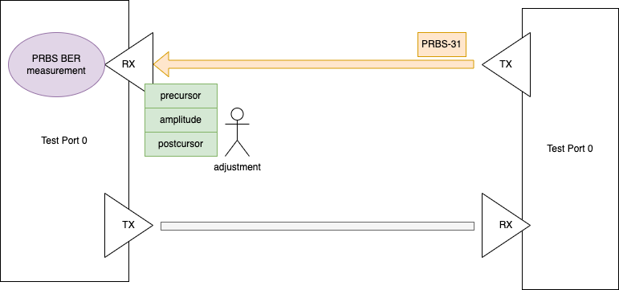

Target PRBS BER Performance
==========================================

Objective
----------

Using CMIS standard page/reg addresses, the test aims to find the transceiver output RX tap values (main, precursor, post cursor) that reduce the PRBS BER at the RX side below a target value. It is not meant to find the optimal settings but the good-enough.

Setup
----------

* The transceiver has 3 taps to adjust: amplitude, precursor and postcursor.
* Each tap starts with an initial value ``<amp_init>``, ``<pre_init>``, ``<post_init>``.
* Each tap value ranges from 0 to 7 dB.
* The target PRBS BER value ``<target_ber>`` is set by the users.
* Delay after EQ write ``<delay_after_eq_write>``.

Method
----------

    Cable performance test illustration

1. The TX port sends PRBS-31 test pattern to the RX port.
2. Load ``<amp_init>``, ``<pre_init>``, and ``<post_init>`` on the RX port. 
3. The RX port keeps measuring the PRBS BER.
4. The RX port Increments the amplitude tap value.
5. If the PRBS BER decreases, back to  4, until the tap limit is reached. 
   If the PRBS BER increases, roll back the previous amplitude tap value.
   If the PRBS BER is lower than ``<target_ber>``, quit the searching. 
6. The RX port Increments the precursor tap value.
7. If the PRBS BER decreases, back to 6, until the tap limit is reached. 
   If the PRBS BER increases, roll back the previous precursor tap value.
   If the PRBS BER is lower than ``<target_ber>``, quit the searching. 
8. The RX port Increments the postcursor tap value.
9. If the PRBS BER decreases, back to 8, until the tap limit is reached. 
   If the PRBS BER increases, roll back the previous postcursor tap value.
   If the PRBS BER is lower than ``<target_ber>``, quit the searching. 