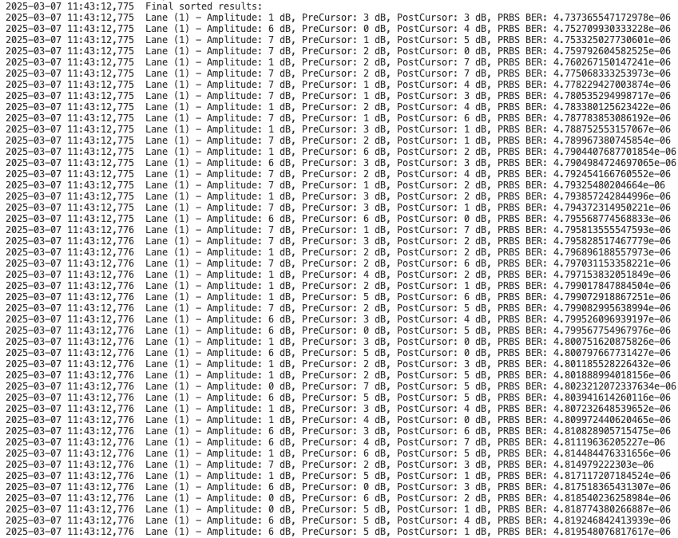

Step-by-Step
=============================

Prerequisite
-------------

1. **Python**: >= 3.11.
2. **Download prooject**: Get`latest release <https://github.com/xenanetworks/cable-perf-test-suite/releases>`_.
3. **Install dependencies using pip**:

.. code-block:: bash

      pip install -r requirements.txt # For Windows
      pip3 install -r requirements.txt # For Linux/macOS

The required packages are listed in the ``requirements.txt`` file.

.. note::

    ``tdl-xoa-driver`` is developed by Teledyne LeCroy Xena. You can read more about this package in `XOA Driver Documentation <https://docs.xenanetworks.com/projects/tdl-xoa-driver/en/latest/index.html>`_.

Change Test Configuration
-------------------------

Go to ``test/`` directory, change the ``test_config.yml`` to meet your test setup and requirements.

.. code-block:: yaml

    test_config:
      chassis_ip: "10.165.136.60"
      username: "CPOM"
      password: "xena"
      tcp_port: 22606
      log_filename: "xena_cpom.log"
      csv_report_filename: "xena_cpom_report.csv
      tcvr_rx_output_eq_test_config:
        port_pair_list:
          - tx: "3/0"
            rx: "6/0"
        module_media: "QSFPDD800"
        port_speed: "1x800G"
        lane: [1]
        delay_after_reset: 2
        prbs_config:
          polynomial: "PRBS31"
          duration: 2
        rx_output_eq_range:
          amp_min: 0
          amp_max: 3
          pre_min: 0
          pre_max: 7
          post_min: 0
          post_max: 7
        delay_after_eq_write: 2
      tcvr_tx_input_eq_test_config:
        port_pair_list:
          - tx: "3/0"
            rx: "6/0"
        module_media: "QSFPDD800"
        port_speed: "1x800G"
        lane: [1]
        delay_after_reset: 2
        prbs_config:
          polynomial: "PRBS31"
          duration: 2
        tx_input_eq_range:
          min: 0
          max: 12
        delay_after_eq_write: 2
      host_tx_eq_test_config: # This is the test configuration for RX output equalization (optional)
        port_pair_list:
          - tx: "0/0"
            rx: "0/0"
        module_media: "OSFP_1600"
        port_speed: "1x1600G"
        lane: [3]
        delay_after_reset: 2
        prbs_config:
          polynomial: "PRBS31"
          duration: 10
        delay_after_eq_write: 2
        target_ber: 1e-10
        start_txeq:
          pre3: 0
          pre2: 0
          pre1: 0
          main: 100
          post1: 0
          post2: 10
        optimize_mode: "exhaustive"  # "heuristic" or "exhaustive"
        optimize_txeq_ids: [0, -1, 1, -2, -3, 2]

* ``chassis_ip``: the IP address of the chassis
* ``username``: the name used to connect to the chassis and reserve ports
* ``password``: the password used to connect to the chassis
* ``tcp_port``: the port number used to connect to the chassis
* ``log_filename``: the log filename
* ``csv_report_filename``: the CSV report filename
* ``tcvr_rx_output_eq_test_config``: the test configuration of RX output equalization optimization

    * ``port_pair_list``: a list of port pairs

        * ``tx``: the ID (module/port) of the port that transmits PRBS
        * ``rx``: the ID (module/port) of the port that measures PRBS BER

    * ``module_media``: the module media mode to apply
    * ``port_speed``: the port speed mode in the format of <port count>x<port speed>
    * ``lane``: the lane index you want to test, from 1 to 8.
    * ``delay_after_reset``: waiting time in seconds after port reset
    * ``prbs_config``

        * ``polynomial``: the PRBS polynomial to use
        * ``duration``: PRBS BER measurement duration in seconds

    * ``rx_output_eq_range``:

        * ``amp_min``: the minimum amplitude cursor code value
        * ``amp_max``: the maximum amplitude cursor code value
        * ``pre_min``: the minimum pre-cursor code value
        * ``pre_max``: the maximum pre-cursor code value
        * ``post_min``: the minimum post-cursor code value
        * ``post_max``: the maximum post-cursor code value
    
    * ``delay_after_eq_write``: waiting time in seconds after writing the cursor values

* ``tcvr_tx_input_eq_test_config``: the test configuration of TX input equalization optimization
  
    * ``port_pair_list``: a list of port pairs

        * ``tx``: the ID (module/port) of the port that transmits PRBS
        * ``rx``: the ID (module/port) of the port that measures PRBS BER

    * ``module_media``: the module media mode to apply
    * ``port_speed``: the port speed mode in the format of <port count>x<port speed>
    * ``lane``: the lane index you want to test, from 1 to 8.
    * ``delay_after_reset``: waiting time in seconds after port reset
    * ``prbs_config``

        * ``polynomial``: the PRBS polynomial to use
        * ``duration``: PRBS BER measurement duration in seconds

    * ``tx_input_eq_range``:

        * ``min``: the minimum code value
        * ``max``: the maximum code value
    
    * ``delay_after_eq_write``: waiting time in seconds after writing the cursor values

* ``host_tx_eq_test_config``: the test configuration of host TX equalization optimization (optional)
  
    * ``port_pair_list``: a list of port pairs

        * ``tx``: the ID (module/port) of the port that transmits PRBS
        * ``rx``: the ID (module/port) of the port that measures PRBS BER

    * ``module_media``: the module media mode to apply
    * ``port_speed``: the port speed mode in the format of <port count>x<port speed>
    * ``lane``: the lane index you want to test, from 1 to 8.
    * ``delay_after_reset``: waiting time in seconds after port reset
    * ``prbs_config``

        * ``polynomial``: the PRBS polynomial to use
        * ``duration``: PRBS BER measurement duration in seconds

    * ``target_ber``: the target BER to achieve
    * ``start_txeq``: the preset EQ tap values before starting the test
        * ``pre3``: pre-cursor 3 value
        * ``pre2``: pre-cursor 2 value
        * ``pre1``: pre-cursor 1 value
        * ``main``: main cursor value
        * ``post1``: post-cursor 1 value
        * ``post2``: post-cursor 2 value

    * ``delay_after_eq_write``: waiting time in seconds after writing the cursor values
    * ``optimize_mode``: the search mode, can be either "heuristic" or "exhaustive". When exhaustive mode is selected, the target BER will be ignored. All possible combinations of EQ settings within the specified range will be tested to find the optimal settings. This mode is more time-consuming but guarantees finding the best settings. In heuristic mode, a more efficient algorithm is used to find good settings quickly, but it may not find the absolute best settings.
    * ``optimize_txeq_ids``: a list of EQ taps to be adjusted during the test. 0 = main, -1 = pre1, -2 = pre2, -3 = pre3, 1 = post1, 2 = post2. The order of the taps in the list determines the sequence in which they are adjusted during the test.

Run the Test
------------

To start the test, run:

* **Windows**: ``python test.py``
* **Linux/macOS**: ``python3 test.py``

The test log and results will be saved in a different folder each time you run the test, and will also be printed on the console.

    Test in process

    Test results