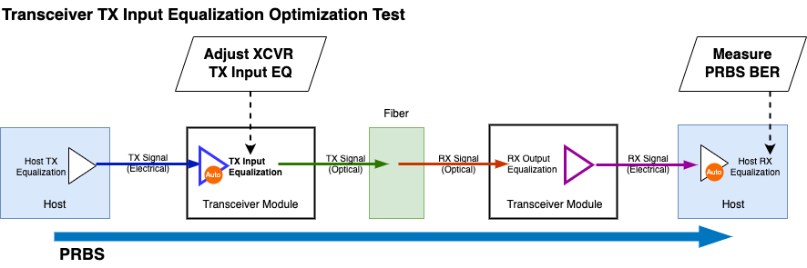
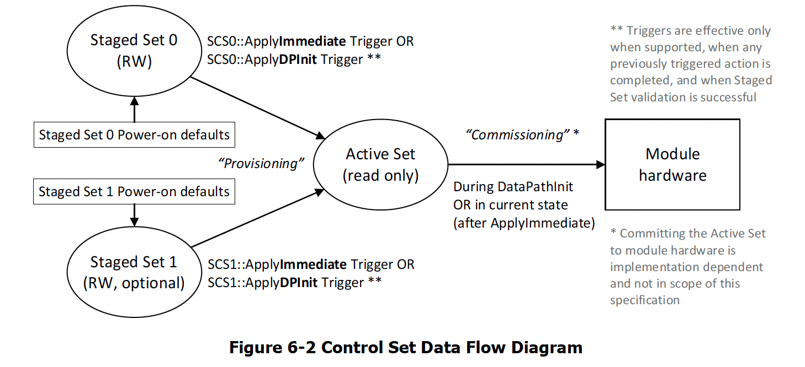
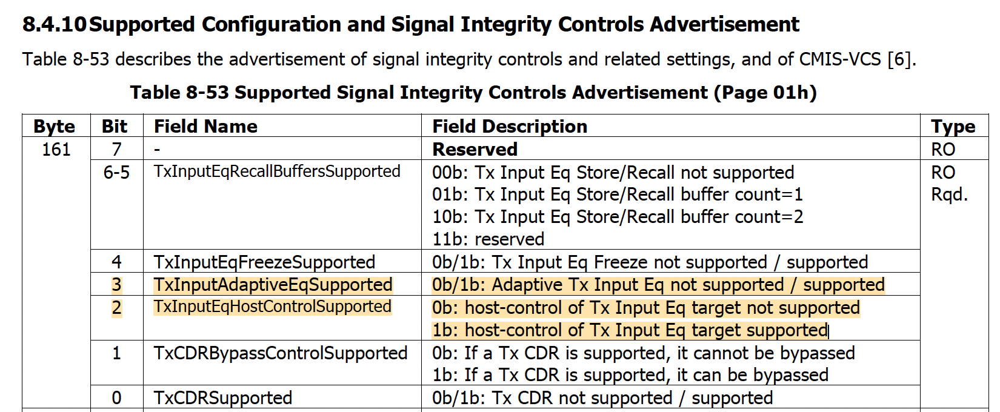
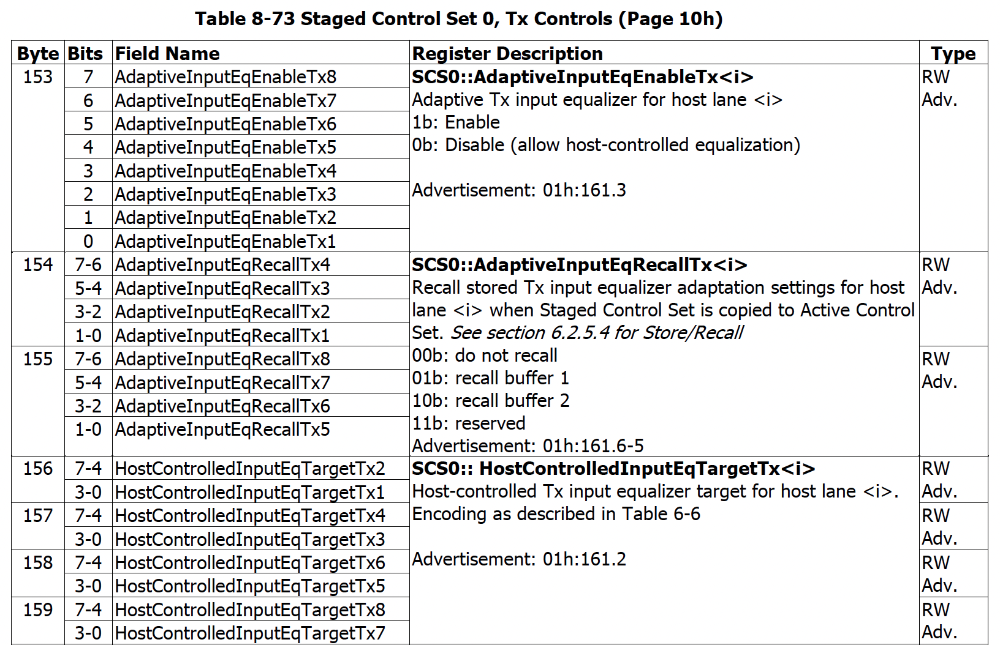

TX Input EQ Optimization Test
=======================================

    TX Input Equalization Optimization

Objective
----------

Using CMIS standard page/reg addresses, the test aims to find the transceiver TX input equalization settings that delivers the best PRBS BER performance. The test exhausts all the TX input equalizer combinations to find the optimal setting.

Setup
----------

* The transceiver one TX input equalizer to adjust, with a range of ``<min>`` and ``<max>``, in code values.
* PRBS measurement duration ``<duration>``.
* PRBS polynomial ``<polynomial>``.

Methodology
--------------

The principle of the test is to find the TX Input EQ setting that deliver the best PRBS BER performance. The test is based on the CMIS standard page/reg addresses. The test is automated and can be run on Xena test equipment with Z800 Freya modules.

1. Check if the transceiver module supports **TX Input EQ Host Control** as described in `TX Input EQ Host Control Support Advertisement`_. If the transceiver module supports TX Input EQ Host Control, the test can be run. Else, the test will abort.
2. Start PRBS test pattern transmission from the TX port to the RX port, and measure the PRBS BER at the RX port. The measurement is set to accumulative mode to get a stable BER value after a certain duration.
3. If the transceiver module supports **Reconfiguration** (``00h:2.6 SteppedConfigOnly``, ``00h:2.1-0 AutoConmmisioning``), **disable adaptive input equalization** and **write the TX Input EQ settings to the TX Input EQ registers**, as described in `TX Input EQ Register`_.
4. Trigger the **Provision-and-Commission** or **Provision** procedure via ``10h:144`` or ``10h:143``.
5. Read the ``ConfigStatus`` register to check if the TX Input EQ settings are applied. This is implemented by reading ``11h:202-205``.
6. If ``ConfigStatus == ConfigSuccess``, wait for a certain duration to allow the TX Input EQ settings to stablize. Clear PRBS BER counter. Read the PRBS BER at the RX port for a certain duration, and save the last reading.
7. If ``ConfigStatus != ConfigSuccess``, skip the PRBS measurement and continue to the next TX Input EQ settings.
8. An **exhaustive search** is performed to find the TX Input EQ settings that yield **the lowest PRBS BER**. Thus, the test will repeat until all possible TX Input EQ settings are tested.

    CMIS Control Set Data Flow

TX Equalizer Control
---------------------

TX EQ (TX input equalizer control) settings can be either **Host-Controlled** or **Adaptive**. For TX Input Equalization Optimization Test to work, the TX EQ settings must be Host-Controlled. The test will not work if the TX EQ settings are Adaptive.

TX Input EQ Host Control Support Advertisement
^^^^^^^^^^^^^^^^^^^^^^^^^^^^^^^^^^^^^^^^^^^^^^^

.. _cmis_tx_eq_support:

    TX Input EQ Host Control Support Advertisement

If the ``TxInputEqHostControlSupported`` flag is ``1b``, as defined in :numref:`cmis_tx_eq_support`, then the module supports host-control of Tx Input Equalization. In this case, the host can control the Tx Input Equalization settings. If the flag is ``0b``, then the module does not support host-controlled Tx input equalization. Then the test won't be able to proceed with the optimization.

TX Input EQ Register
^^^^^^^^^^^^^^^^^^^^

.. _cmis_tx_input_eq_ctrl:

.. figure:: images/cmis_tx_input_eq_ctrl.png

    Tx Input Eq control relationship to AdaptiveInputEqEnableTx

For the host to apply new TX SI settings, the ``AdaptiveInputEqEnableTx`` (``10h:153``) must be ``0b`` as defined in :numref:`cmis_tx_input_eq_ctrl`. This will disable the adaptive EQ and allow the host to apply new TX SI settings.

.. _cmis_tx_input_eq_reg:

    TX Input EQ Registers

TX Input EQ register control: ``Page 10h, Byte 153 – 159``, as defined in :numref:`cmis_tx_input_eq_reg`, can be used to control the TX input EQ settings.

