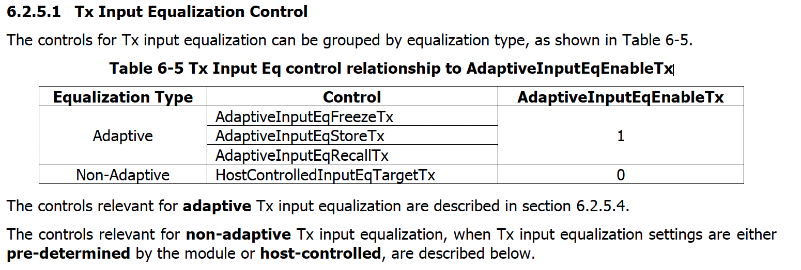

TX Input Equalization Test
==========================

.. important::

    This test is under development.

TX Equalizer Control
---------------------

TX EQ (TX input equalizer control) settings can be either FIXED or ADAPTIVE. For TX input, only adaptive EQ should be used, and it is the default setting in the module. Fixed EQ is not recommended for the TX direction and will not function correctly unless explicitly advised.

.. _cmis_tx_eq_support:

.. figure:: images/cmis_tx_eq_support.png

    TX Input EQ Advertisement

If the ``TxInputEqFixedManualControlSupported`` flag is set, as defined in :numref:`cmis_tx_eq_support`, then the module supports host-controlled Tx input equalization. In this case, the host can control the Tx input equalization settings. If the flag is not set, then the module does not support host-controlled Tx input equalization.

TX Input EQ Advertisement
^^^^^^^^^^^^^^^^^^^^^^^^^

.. _cmis_tx_input_eq_ctrl:

    TX Input EQ Control

TX Input EQ Register
^^^^^^^^^^^^^^^^^^^^

For the host to apply new TX SI settings, the ``AdaptiveInputEqEnableTx`` must be cleared as defined in :numref:`cmis_tx_input_eq_ctrl`. This will disable the adaptive EQ and allow the host to apply new TX SI settings.

.. _cmis_tx_input_eq_reg:

    TX Input EQ Registers

TX Input EQ register control: ``Page 10h, Byte 153 – 159``, as defined in :numref:`cmis_tx_input_eq_reg`, can be used to control the TX input EQ settings.

