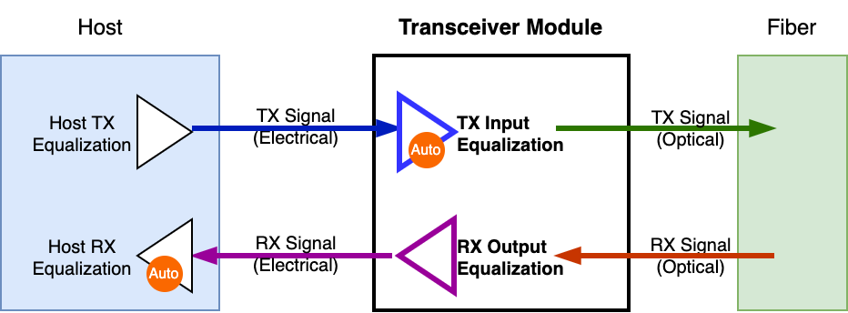

Understanding Transceiver Equalization
======================================

Transceiver RX Output Equalization and TX Input Equalization are two critical concepts in high-speed interconnects. They refer to the equalization settings applied to the received signal (RX) and transmitted signal (TX) in optical transceivers. These settings are essential for optimizing signal integrity and minimizing bit error rate (BER) in high-speed data center networks.

.. _eq_in_transceiver_module:

    Equalization in Transceiver Module

:numref:`eq_in_transceiver_module` illustrates the concept of equalization in a transceiver module.

* The transceiver receives an optical signal from the fiber, processes it internally, and then outputs an electrical signal to the host system. The RX Output Equalization is applied **after** the module converts the optical signal to electrical before sending it to the host.
* The transceiver receives an electrical signal from the host system, processes it internally, and then converts it to an optical signal for transmission over the fiber. The TX Input Equalization is applied **before** the module converts the electrical signal to optical for transmission.

Understanding the RX Output Equalizer in Transceivers
------------------------------------------------------

RX Output Equalization refers to the signal coming out of the module’s RX lanes (going toward the host). The module receives a signal from the fiber, processes it internally, and then outputs it to the host.

RX Output Equalization controls how the transceiver drives the signal back to the host, adjusting amplitude and emphasis to In high-speed transceivers, the RX Output Equalizer plays a vital role in shaping the electrical signal sent from the transceiver’s receiver (RX) to the host system. Its main function is to fine-tune the amplitude and emphasis of the output signal, ensuring it maintains optimal signal integrity as it reaches the host’s receiver circuitry.

Key Functions:

* **Signal Conditioning**: By precisely adjusting the signal’s characteristics, the RX Output Equalizer compensates for any distortions or losses that may have occurred during transmission, thereby enhancing the quality of the signal delivered to the host.
* **Programmable Settings**: Many modern transceivers provide programmable RX output amplitude and pre-emphasis settings, allowing for customization to meet specific system requirements. This programmability ensures precise control over the signal’s properties, aligning them with the host’s expectations.

The RX Output Equalizer plays a vital role in ensuring that the signal transmitted from the transceiver to the host is of high quality and integrity. By adjusting the output signal’s amplitude and emphasis, it helps maintain reliable communication between the transceiver and the host system.

Understanding the TX Input Equalizer in Transceivers
------------------------------------------------------

Adjusting the TX input equalizer in transceivers is crucial when the incoming signal has experienced significant distortion or attenuation during transmission. This process fine-tunes the equalization settings to counteract channel impairments, ensuring optimal signal integrity and minimizing bit error rates.

Key Scenarios Requiring TX Input Equalizer Tuning:

* **High-Frequency Signal Transmission**: At high data rates, signals are more prone to frequency-dependent losses and inter-symbol interference (ISI). By adjusting the TX input equalizer, these effects can be mitigated, resulting in clearer signal reception.
* **Long-Distance Signal Transmission**: When signals travel over long distances, they encounter various impairments such as attenuation and dispersion. The TX input equalizer can be used to compensate for these losses, ensuring that the transmitted signal remains robust and error-free.
* **Varying Channel Conditions**: Equalizer adjustments adapt to different channel characteristics, such as impedance mismatches and insertion losses.

Tuning the TX input equalizer is essential in high-speed transceiver systems, especially when handling high-frequency signals, long transmission distances, or varying channel conditions. Proper tuning improves signal integrity, minimizes errors, and ensures reliable communication across different transmission environments.

Adaptive Equalization in Transceivers
-------------------------------------------

Adaptation usually happens on the receiver side:

* Host RX (Receiving from the module):

  * The host’s receiver typically has adaptive equalization to handle variations in signal quality.
  * This includes CTLE (Continuous-Time Linear Equalization), DFE (Decision Feedback Equalization), and AGC (Automatic Gain Control).
  * It dynamically adjusts to compensate for loss, noise, and distortion.

* Module RX (Receiving from the host, TX Input Equalization):

  * Many transceivers have adaptive equalization on their electrical RX side.
  * If the module supports auto-adaptation, the TX Input Equalization tunes itself based on signal conditions.
  * This is useful for long PCB traces and backplane applications.

But Transmit Equalization (TX) is usually fixed:

* Host TX (Sending to the module):

    * The host sets a fixed TX equalization profile before transmission.
    * It usually provides main cursor, pre-cursor, and post-cursor control, but these values don’t auto-adapt.
    * The system designer or firmware needs to tune them for optimal eye opening.

* Module TX (Sending to the host, RX Output Equalization):

    * Similarly, the module’s TX side (which the host receives) is typically fixed once set.
    * If CMIS allows updates, you can change the equalization settings manually, but it won’t adapt on its own.